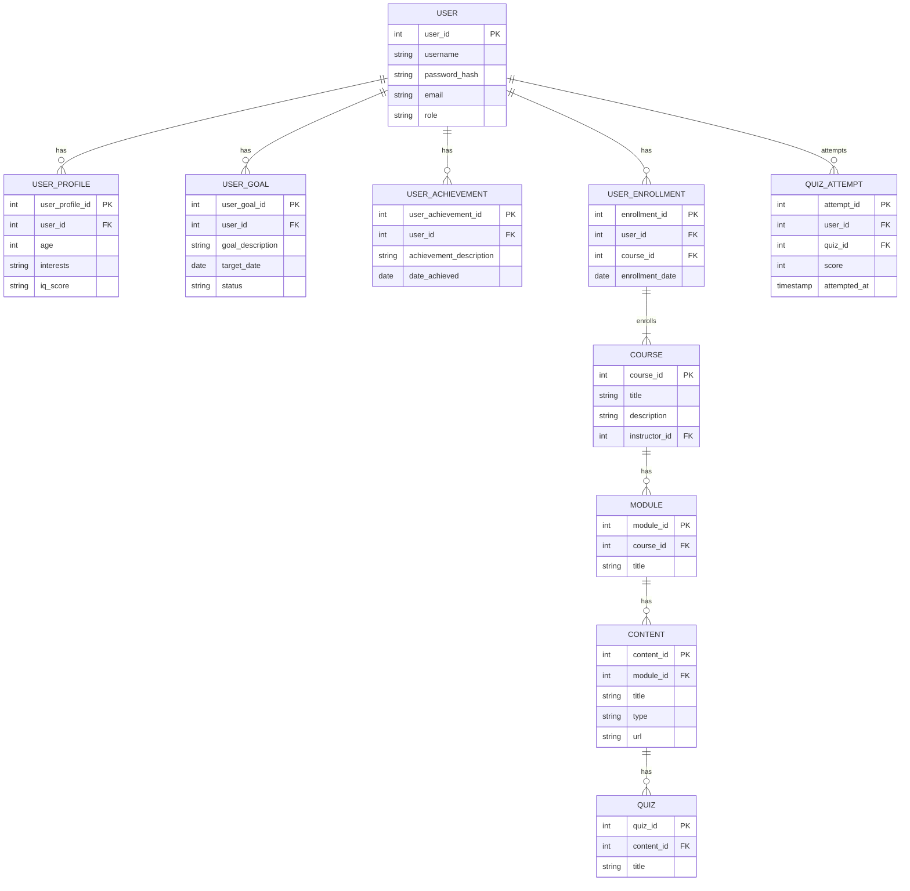

# Database Schema

## 1. Overview

This document outlines the proposed database schema for the learning application. The schema is designed to be flexible and scalable to support the application's features.

## 2. ERD Diagram

## 3. Table Descriptions

*   **USER:** Stores user account information.
*   **USER_PROFILE:** Stores additional information about the user, such as age, interests, and IQ.
*   **USER_GOAL:** Stores user-defined learning goals.
*   **USER_ACHIEVEMENT:** Stores user achievements and badges.
*   **COURSE:** Stores information about courses.
*   **USER_ENROLLMENT:** Stores information about user enrollments in courses.
*   **MODULE:** Stores information about modules within a course.
*   **CONTENT:** Stores information about learning content within a module.
*   **QUIZ:** Stores information about quizzes.
*   **QUIZ_ATTEMPT:** Stores user attempts at quizzes.
