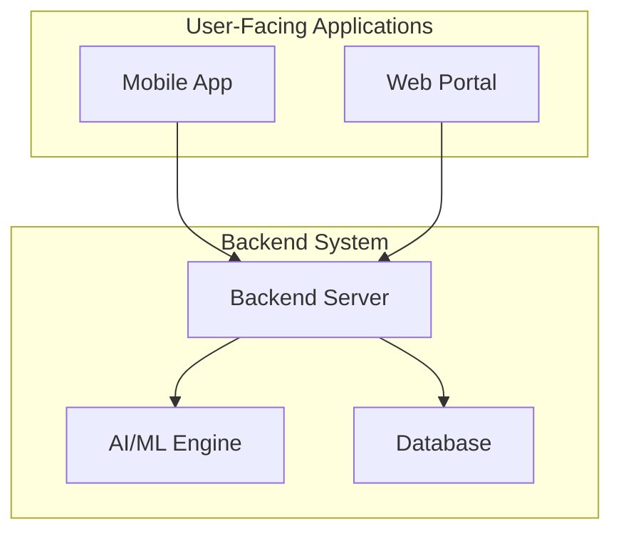

# System Architecture

## 1. Overview

This document outlines the high-level system architecture for the AI/ML-powered learning application. The system will consist of a mobile application for learners, a web portal for administrators, instructors, mentors, institutions, and companies, and a backend system that includes AI/ML models for personalization.

## 2. Components

The system will be composed of the following major components:

*   **Mobile Application (Learner-facing):** A cross-platform mobile app (iOS and Android) that provides a personalized learning experience to users.
*   **Web Portal (Admin/Instructor/Mentor-facing):** A web-based portal for managing content, users, and analytics.
*   **Backend Server:** The core of the system, responsible for business logic, data storage, and serving the mobile and web applications.
*   **AI/ML Engine:** A set of services and models for content recommendation, user profiling, and adaptive learning.
*   **Database:** A database to store user data, content, and other application data.

## 3. Architecture Diagram

## 4. Technology Stack (Initial Proposal)

*   **Mobile App:** React Native or Flutter (for cross-platform development)
*   **Web Portal:** React or Angular
*   **Backend Server:** Node.js with Express or Python with Django/FastAPI
*   **AI/ML Engine:** Python with TensorFlow or PyTorch
*   **Database:** PostgreSQL or MongoDB
