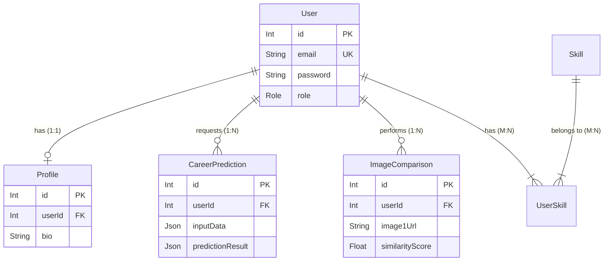

# 🗄️ Database Architecture Documentation

This document provides a comprehensive technical breakdown of the PostgreSQL database schema used in the Skill Compass AI Backend, managed via **Prisma ORM**.

## 1️⃣ Entity Relationship Diagram (ERD)

**Conceptual Overview**:

- **Users** are the central entity.
- **Users** have a **One-to-One** relationship with **Profiles** (extended details).
- **Users** have a **One-to-Many** relationship with **CareerPredictions** (history).
- **Users** have a **One-to-Many** relationship with **ImageComparisons** (history).
- **Users** have a **Many-to-Many** relationship with **Skills** (via the explicit join table `UserSkill`).



---

## 2️⃣ Table Schemas

### 👤 `User`

**Purpose**: Stores authentication credentials and core identity information.

| Column      | Type        | Attributes                          | Description                              |
| :---------- | :---------- | :---------------------------------- | :--------------------------------------- |
| `id`        | `Int`       | **PK**, `@default(autoincrement())` | Unique identifier for the user.          |
| `email`     | `String`    | **Unique**                          | User's email address used for login.     |
| `password`  | `String`    |                                     | Hashed password string (Bcrypt).         |
| `name`      | `String`    |                                     | Full name of the user.                   |
| `role`      | `Role`      | `@default(user)`                    | Access control role (`user` or `admin`). |
| `dob`       | `DateTime?` |                                     | Date of Birth (Optional).                |
| `createdAt` | `DateTime`  | `@default(now())`                   | Timestamp of account creation.           |
| `updatedAt` | `DateTime`  | `@updatedAt`                        | Timestamp of last account update.        |

---

### 🆔 `Profile`

**Purpose**: Stores extended optional user information to keep the `User` table lightweight.

| Column        | Type      | Attributes                          | Description                             |
| :------------ | :-------- | :---------------------------------- | :-------------------------------------- |
| `id`          | `Int`     | **PK**, `@default(autoincrement())` | Unique identifier.                      |
| `bio`         | `String?` |                                     | Short biography or "About Me".          |
| `avatarUrl`   | `String?` |                                     | URL path to the user's profile picture. |
| `githubUrl`   | `String?` |                                     | External link to GitHub profile.        |
| `linkedinUrl` | `String?` |                                     | External link to LinkedIn profile.      |
| `userId`      | `Int`     | **FK**, **Unique**                  | Foreign key linking to `User.id`.       |

**Relationships**:

- `user`: Relation to `User` model (`onDelete: Cascade` - deleting User deletes Profile).

---

### 🎓 `CareerPrediction`

**Purpose**: Immutable audit log of career recommendation requests made by the user.

| Column             | Type       | Attributes                          | Description                                              |
| :----------------- | :--------- | :---------------------------------- | :------------------------------------------------------- |
| `id`               | `Int`      | **PK**, `@default(autoincrement())` | Unique identifier.                                       |
| `inputData`        | `Json`     |                                     | Raw JSON of parameters sent to ML (grades, interests).   |
| `predictionResult` | `Json`     |                                     | Raw JSON response from ML service (recommended careers). |
| `createdAt`        | `DateTime` | `@default(now())`                   | When the prediction was requested.                       |
| `userId`           | `Int`      | **FK**                              | Foreign key linking to `User.id`.                        |

**Relationships**:

- `user`: Relation to `User` model.

---

### 🖼️ `ImageComparison`

**Purpose**: Tracks usage and results of the CLIP Image Analysis tool.

| Column            | Type               | Attributes                          | Description                                                    |
| :---------------- | :----------------- | :---------------------------------- | :------------------------------------------------------------- |
| `id`              | `Int`              | **PK**, `@default(autoincrement())` | Unique identifier.                                             |
| `image1Url`       | `String`           |                                     | Storage path/URL for the first source image.                   |
| `image2Url`       | `String`           |                                     | Storage path/URL for the second source image.                  |
| `tag`             | `String?`          |                                     | Optional text tag used for context matching.                   |
| `similarityScore` | `Float?`           |                                     | The calculated cosine similarity (0.0 to 1.0). Null if failed. |
| `status`          | `ComparisonStatus` | `@default(PENDING)`                 | Current state of the async/long-running process.               |
| `resultData`      | `Json?`            |                                     | Detailed breakdown (vectors, raw logs) from ML service.        |
| `createdAt`       | `DateTime`         | `@default(now())`                   | When the comparison was started.                               |
| `userId`          | `Int`              | **FK**                              | Foreign key linking to `User.id`.                              |

**Relationships**:

- `user`: Relation to `User` model.

---

### 🛠️ `Skill`

**Purpose**: Master list of all available skills in the platform.

| Column | Type     | Attributes                          | Description                                            |
| :----- | :------- | :---------------------------------- | :----------------------------------------------------- |
| `id`   | `Int`    | **PK**, `@default(autoincrement())` | Unique identifier.                                     |
| `name` | `String` | **Unique**                          | Name of the skill (e.g., "Python", "Public Speaking"). |

**Relationships**:

- `users`: List of `UserSkill` entries (Many-to-Many).

---

### 🔗 `UserSkill` (Join Table)

**Purpose**: Explicit Many-to-Many link between Users and Skills, allowing extra metadata (like `assignedAt`).

| Column       | Type       | Attributes                          | Description                                      |
| :----------- | :--------- | :---------------------------------- | :----------------------------------------------- |
| `id`         | `Int`      | **PK**, `@default(autoincrement())` | Unique identifier.                               |
| `userId`     | `Int`      | **FK**                              | Link to `User`.                                  |
| `skillId`    | `Int`      | **FK**                              | Link to `Skill`.                                 |
| `assignedAt` | `DateTime` | `@default(now())`                   | When this skill was added to the user's profile. |

**Constraints**:

- `@@unique([userId, skillId])`: A user cannot have the same skill assigned twice.

---

### 🌟 `Interest`

**Purpose**: Master list of all available interests in the platform for career recommendations.

| Column | Type     | Attributes                          | Description                                                   |
| :----- | :------- | :---------------------------------- | :------------------------------------------------------------ |
| `id`   | `Int`    | **PK**, `@default(autoincrement())` | Unique identifier.                                            |
| `name` | `String` | **Unique**                          | Name of the interest (e.g., "Cloud computing", "Technology"). |

---

## 3️⃣ Enums & Types

### Enum: `Role`

Used in `User.role` for authorization.

```prisma
enum Role {
  user // Standard access
  admin // Elevated access (manage users, view all logs)
}
```

### Enum: `ComparisonStatus`

Used in `ImageComparison.status` to track ML processing state.

```prisma
enum ComparisonStatus {
  PENDING // Request sent to FastAPI, waiting for response
  COMPLETED // Result received successfully
  FAILED // Error occurred during processing
}
```

## 4️⃣ JSON Data Structures

### `CareerPrediction.inputData` Example

```json
{
  "academic_score": 85,
  "interests": ["coding", "mathematics"],
  "personality_type": "INTJ"
}
```

### `CareerPrediction.predictionResult` Example

```json
{
  "careers": [
    { "title": "Data Scientist", "confidence": 0.92 },
    { "title": "Software Engineer", "confidence": 0.88 }
  ],
  "timestamp": "2024-01-01T12:00:00Z"
}
```

## 5️⃣ Operational Notes

- **Cascade Deletes**: Deleting a `User` will automatically delete their `Profile` due to `onDelete: Cascade`. It will **NOT** automatically delete `CareerPrediction` or `ImageComparison` records (referential integrity is preserved for history), unless configured otherwise in future migrations.
- **Timestamps**: All valid records use UTC for `DateTime` fields.
- **Foreign Keys**: All relationships use integer IDs.
